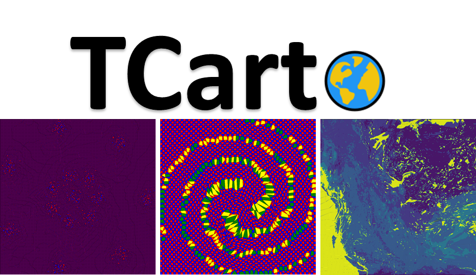

<!-- -->

TCarto is a simple, scalable, parallel code optimization for Table Cartograms.
TCarto is written in python. It uses local optimization based approach to construct table cartograms that gradually transforms the cells to improve the area discrepancies.

This readme explains how to set-up and use this code as well as the Dataset Description and input data format.

# Dataset Description
TCarto has been evaluated using a rich database containing both Real-life and Synthetic Datasets of different grid sizes.

## Real-life Dataset
One Real-life Dataset is the `car' dataset, which is a commonly used dataset for infographic examples. The other one is Weather Research and Forecasting (WRF) model output for five weather parameters Soil Moisture (SMOIS), Surface Skin Temperature (TSK), Planetary Boundary Layer Height (PBLH), Soil Liquid Water (SH2O) and Surface Emissivity (EMISS). This geospatial dataset spans the western provinces of Canada. All these datasets are analyzed in 64x64 grids.

## Synthetic Dataset
We generated a synthetic dataset using the ELKI data mining frameworks, which a widely used software for clustering and generating cluster datasets with user specified distributions. Our motivation for using synthetic data was to examine data characteristics that may influence the cartographic accuracy of a table cartogram. Hence we found ELKI to be an excellent choice for generating synthetic data. Our ELKI dataset contains two sets: (Set-I) varies the cluster number (2,4,8), and (SET-II) varies the standard deviation $\sigma$ (0.25,0.5,0.75). The other input parameters are chosen at random. For each group (e.g., 4 clusters in Set-I), we generate 10 instances. All the instances are two dimensional and the clusters have a Gaussian distribution in both dimensions. The ELKI datasets are in 8x8, 16x16, 32x32 and 64x64 resolution.

We also used a benchmark `Shape' dataset to see whether table cartograms preserve various shapes. All the shape datasets are in resolution 8x8, 16x16, 32x32, 64x64, 128x128, 256x256 and 512x512.

# Input Data Format:
This code expects only one input data file. We suggest to unzip Datasets.zip and put it in the same directory. Please, copy the data file you are interested into 'input' folder and always generate output into 'output' folder. The only input data file is a (.txt) file that holds the weights/area values of the grids/cells of the cartogram. For example, an input data file (e.g. D31_cluster_31_grid_2_2.txt, located at '\Datasets\Synthetic Datasets\Shape Dataset' folder) is for a 2 by 2 grid cartogram. The data it contains is as follows.

1.0916129032,0.9161290323,

0.8670967742,1.1225806452

It means the targeted weights or area values of the output 2x2 cartogram would be 1.0916, 0.9161, 0.8671 and 1.1226 for top left, top right, bottom left and bottom right cell/grid respectively.

# Set-up and Dependencies:
1. Python 3.7 or higher version should be installed. You can download it from here: https://www.python.org/downloads/
2. MiniConda3 or Conda 4.6 or higher version should be installed.
3. Install 'CVXOPT' by using 'pip install cvxopt' or 'conda install -c conda-forge cvxopt'
4. Install 'Sympy' by using 'pip install sympy'
5. Install 'Pillow' by using 'pip install Pillow'
6. Install 'matplotlib' using 'conda install -c conda-forge matplotlib'

# Running Code and Generating Cartogram:

1. Unzip Datasets.zip
2. Copy the interested data file inside from 'Datasets' folder to the 'input' folder. For example, copy 'PBLH_grid64_64.txt' file from 'Datasets\Datasets_checked\Real-life Dataset\' folder to 'input' folder.
3. Navigate (using terminal on Linux/Ubuntu and command prompt on Windows) to the directory with the TCarto root directory.
4. Run the executable using the following command
>python <python_file> <number_of_squared_grid> <input_data_file> <output_log_and_image_filename>

For example,
>python PrescribedAreaDrawingDivideConq.py 64 "input/PBLH_10_new_grid64_64.txt" "DivCon_PBLH_10_new_grid64_64"'

python_file -> The python file we want to run

number_of_squared_grid -> Total number of grid for square shape in an edge

input_data_file -> A (.txt) file as an input data file having weights of each and every cell of the cartogram

output_log_and_image_filename -> This is just the filename for the output image and output log file

---
# Different Algorithms

There are three algorithms that we want to run and compare for different datasets.

Approaches of Evans et al. on their [Table Cartogram](https://www.sciencedirect.com/science/article/abs/pii/S0925772117300627) paper 
* Base Case Table Cartogram

Our approaches:
* Parallel Optimization (Parallel-OPT)
* Divide and Conquer (DIV-CON) Approach

## 1. Base Case
---
In 2013, Evans et al. proven on their [Table Cartogram](https://www.sciencedirect.com/science/article/abs/pii/S0925772117300627) paper that a table cartogram always exists in a rectangle and it is an _O(mn)_-time algorithm. We consider this as base case.

You can run this with below command:
> python <python_file> <number_of_squared_grid> <input_data_file> <input_image_file> <output_log_and_image_filename>

For example,
>python BaseCase.py 8 "input/weight_8_8.txt" "input/weather_tsk.png" "output_GC"

The ouputs will always be generated inside _output_ folder.

## 2. Parallel Optimization (Parallel-OPT)
---
We have parallelized the quadratic optimiztion task for each node into different CPU. The running-time completely depends on the number of CPU.

You can run this with below command:
> python <python_file> <number_of_squared_grid> <number_of_iteration> <input_data_file> <input_image_file> <output_log_and_image_filename>

For example,
>python PrescribedAreaDrawingParallelCodeIMG.py 64 10 "input/PBLH_grid64_64.txt" "input/weather_tsk.png" "Parallel_OPT_64_64_PBLH_"

The ouputs will always be generated inside _output_ folder.

## 3. Divide and Conquer (DIV-CON) Approach
---
We have distributed the weights into different parts at an earlier stage so that it can reach its final output faster.

You can run this with below command:
> python <python_file> <number_of_squared_grid> <input_data_file> <input_image_file> <output_log_and_image_filename>

For example,
>python PrescribedAreaDrawingDivideConqIMG.py 64 "input/PBLH_grid64_64.txt" "input/weather_tsk.png" "DivConImg_PBLH_grid64_64"

The ouputs will always be generated inside _output_ folder.

---
# Different Applications of DIV-CON Approch

## 1. Mosaic Image Generation

### Random Weight Generation
To generate a mosaic image using DIV-CON approach, we have created random weights for all the cells. 

To generate this weight_list.txt file, we can use below command:

> python PrescribedAreaDrawingDivideConqIMG_MosaicGen.py

Inside this PrescribedAreaDrawingDivideConqIMG_MosaicGen.py file there are several variables that helps us to generate different types of weight_list files based on our need.

squared_grid -> Total number of grid for square shape in an edge

output_weight_filename -> This is just the output filename that will generate inside input folder

min_weight_range -> Minimum value of generated weights

max_weight_range -> Maximum value of generated weights

### Run DIV-CON to Generate Mosaic Image
Our algorithm generates the image with distorted grids whose areas are proportinal to their corresponding weights. We have added border color and border width for each cell to get this mosaic effect.

We can run below command to generate mosaic image
> python <python_file> <number_of_squared_grid> <input_data_file> <input_image_file> <output_log_and_image_filename>

For example,
> python PrescribedAreaDrawingDivideConqIMG_MosaicGen.py 32 "input/Mosaic03_mosaic_randomweight_32_32.txt" "input/GI_21.png" "output_DivCon_mosaic_randomweight_32_32"

## 2. Effect of Increasing Illumination of Light Source

### Lightness Calculation from HSL Channel
To calculate the lightness from input image, we have divided the input image into grid. Afterwards, we have calculated the lightness channel for each pixel from HSL image format of a single cell. We considered the average lightness value of all pixels within a single cell as the lightness value for that specific cell. This average lightness values of every cells are our weights for the DIV-CON. 

To generate this weight.txt file, we can use below command:

> python WeightCalculationFromImageBrightness.py

Inside this WeightCalculationFromImageBrightness.py file there are several variables that helps us to generate different types of weight files based on our need.

squared_grid -> Total number of grid for square shape in an edge

input_image_file -> Path for the input image

output_weight_filename -> Path for the generated output text file containing weights for each cell

### Run DIV-CON to Make the effect of increasing illumination of every light sources

Our algorithm generates the image with distorted grids whose areas are proportinal to their corresponding weights. Firstly, we normalize the lightness-weights of each cells from black to white (from 0 to 255) and generate an internediate image in gray scale with distorted grids. Then, we have applied Gaussian Filtering(with radius 10) on the internediate image and generated our processed mask image having incresed illumination from light sources. Finally, we increase the values of lightness channel of input image for every pixels in HSL image format based on the mask image. This lightness has been increased from 0% to a maximum of 25%.

We can run below command to generate the images having this effect
> python <python_file> <number_of_squared_grid> <input_data_file> <input_image_file> <output_log_and_image_filename>

For example,
> python PrescribedAreaDrawingDivideConqIMG.py 128 'input/LowLightImageEnhancement_lightness_weight_128_128.txt' "input/LowLightImageEnhancement.png" 'output_DivCon_room_lightness'

## 3. Cluster Detection with Density Estimation
### Cluster Data Generation and Weight List Calculation
We create cluster data with 4 cluster. Blue cluster has 500 data points, but congest in a smaller region. Orange cluster spreads out more region than blue cluster and it has 200 data points. Both red and green cluster overlap each other while having 100 data points each. We have considered the 2D plane as grid and calculated the number of data points residing in each cell as the weights of corresponding cells.

We have created the data points in CSV, shown them in both charts (with and without cluster) and generated weight.txt file by using below command:

> python ScatterPlotDataAndChartGen.py

Inside this ScatterPlotDataAndChartGen.py file there are several variables that helps us to generate different types of weight files based on our need.

grid_count -> Total number of grid for square shape in an edge

filename -> Initial of CSV files with X and Y co-ordinates

output_txt_file -> Path for the generated output text file containing weights for each cell

percentage_weight_for_empty_point -> Assigning some values in empty cell where there is no data point

### Run DIV-CON to Identify Clusters and Their Densities

Our algorithm generates the image with distorted grids whose areas are proportinal to their corresponding weights. Firstly, we normalize the weights of each cells as gray scale image with distorted cells. Then, we apply Gaussian Filtering(with radius 15) on this image and generate our mask image where higher density cells take larger regions. Finally, we show this mask image in a heat-map chart from where we can understand the number of clusters and their corresponding densities.

We can run below command to generate the images having this effect
> python <python_file> <number_of_squared_grid> <input_data_file> <output_log_and_image_filename>

For example,
> python PrescribedAreaDrawingDivideConq_ScatterPlot.py 64 "input/cluster_4_grid_64_64.txt" "output_DivCon_cluster_4_grid_64_64"